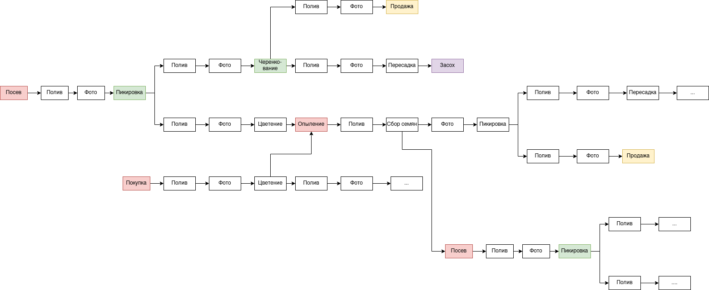

# Plant Passport

## Аудитория и функционал

Сервис ориентирован на 3 группы аудитории:
1. **Простые любители цветов**
Сервис напомнит о своевременном поливе, позволит сохранить и поделиться историей с важными моментами, например фото цветения. 

2. **Коллекционеры и увлеченные** 
Сервис даёт платформу для сбора информации, связанной с растениями и условиями содержания. В результате получить различные статистические срезы, а также создать карточку для каждого растения (паспорт). 

3. **Покупатели растений**
Сервис позволяет перед покупкой верифицировать растение: посмотреть по уникальному ключу (баркоду), привязанному к конкретному экземляру, всю историю его развития, условий содержания, предыдущих владельцев. 

## Как это выглядит для простого любителя цветов
- Человек купил цветок
- В своём аккаунте, создал для него новую карточку (ветвь). 
- Внес минимальное количество данных (всевозможные детали простомю любителю не нужны)
- Внес рекомендуемую частоту (например 1 раз в неделю)
- Идёт время. Человек поливает цветок и вносит об этом информацию в приложение. 
- Если полив происходит реже/чаще, то приложение деликатно информирует человека об этом
- Если полив отсутствует долго, то оповещения появляются более настоятельно
- Когда происходит знаменательное событие в жизни растение (цветение, сброс листьев, линька, болезнь) - человек его фоткат и загружает фото на сервис. Где из фото извлекаются данные о времени съемки и автоподставляются при сохраненнии фото. Т

## Как это выглядит для продвинутых пользователей и коллекционеров
- Человек делает посев 20 семян в один горшок.
- В своём аккаунте создаёт для этого карточку (ветвь)
- Куда заполняет максимальное количество информации об источнике семян, субстрате, размере горшка и т.д. 
- Идёт время. Человек фиксирует все поливы, обратботки от насекомых, удобрения
- Заносит фото. Из exif фото вынимается время съемки и предлагается автоматических его заполнить. 
- В какой-то момент растениям становитс тесно и человек их рассаживает на 3 горшка. Теперь у него вместо 1 карточки 3. 
- Первая карточка завершена. Но у нее имеются дети: 3 штуки. 
- Каждая из трех новых карточек и имеет одного и того же родителя -  карточку 1. 
- Каждая из трех новых карточек по истечении времени может породить новых детей путём еще одной пересадки. Либо может породить семена, которые могут быть посажены, тем самым созав новую ветвь.
- точно также ветвь может погибнуть. 
- в процессе развития растения коллекционеру важно отслеживать его состояние. Для этого он регулярно делает большое количество фото. Чтобы не утруждать себя поиском соответствия сделанного фото с карточкой растения в сервисе - коллекционеру предлагается заменить/дополнить свои этикетки на специально сгенерированные для каждого растения, содержащие QR-код. При загрузки фото с видимым QR-кодом на этикетке, будет произведена автоматическая идентификация растения. Время будет также в автоматическом режиме извлекаться из фотографии. 
- для удобства коллекционера возможна платная опция заказать набор лейблов для своей коллекции растений в оригинальном стиле, с указанием желаемой информации на них

## Как это выглядит для покупателя
- при покупке растения покупателю передаётся сертификат в бумажном или электронном виде, который содержит: 
  - полную информацию о растении в читаемом виде
  - ссылку на карточку растения, перейдя по которой можно также ознакомиться с родителями (родословная)
  - QR-код, являющийся эквивалентом ссылки
  - секретный ключ, позволяющий забрать и закрепить за собой право на наполнение истории растения. 

## Модель данных

- Растение: 
  - Не изменяемые параметры:
    - id
    - полевой номер
    - род (genus)
    - вид (species)
    - подвид (subspecies)
    - разновидность (variety)
    - культивар (cv)
    - уникальный ключ
  - Изменяемые во времени параметры:
    - псевдоним
    - форма горшка (круглый, квадратный, иной)
    - геометрические параметры горшка 
    - субстрат
    - место содержания (город/регион)
  
- Владелец:
  - id
  - имя
  - город
  - почта
  - доп. информация
  - 

- Виды действий над своими растениями: 
  - полив
    - только дата, время
  - химическая обработка
    - препарат, комментарий
  - удобрение
    -  препарат, комментарий
  - пересадка
    - вид и размер нового горшка, субстрат
  - купирование в отдельные горшки
    - порождает несколько отдельных растений, имеющих одинаковую историю. Текущая ветвь прерывается.
  - черенкование
    - порождает новое растение, текущая ветвь продолжается
  - фотофиксация внешнего вида
    - дата, время, загрузка файла, сохранение в разных размерах
  - видеофиксация внешнего вида
    - ссылка на видео
  - переезд
    - новое место содержания

- События:
  - посев
  - линька
  - цветение
  - заболевание
  - выздоровление
  - повреждение
  - гибель

